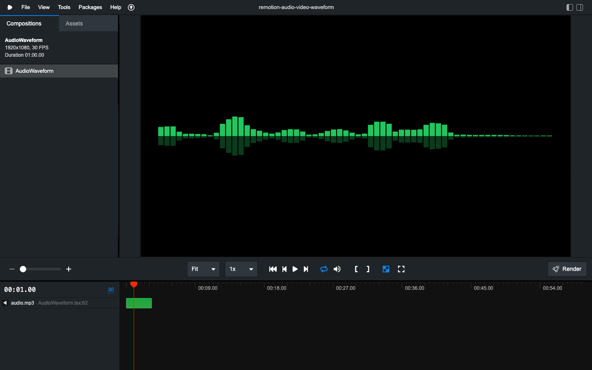

# wavegen Remotion

Remotion template that turns a voice recording into an animated waveform video — bars animate with speech dynamics, taller in the centre, tapering toward the edges.

> [!NOTE]
> Most of the code was written Claude Code.
> See [docs/plans/2026-02-22-audio-waveform-implementation.md](docs/plans/2026-02-22-audio-waveform-implementation.md) for initial plan and design doc [docs/plans/2026-02-22-audio-waveform-design.md](docs/plans/2026-02-22-audio-waveform-design.md)


**[Live demo →](https://gianpaj.github.io/wavegen-remotion/)**

## Setup

```bash
bun install
cp your-audio.mp3 public/audio.mp3
bun run studio        # preview at localhost:3000
```

## Render

```bash
bunx remotionb render AudioWaveform out/waveform.mp4 \
  --props='{"audioFile":"audio.mp3","barColor":"#22c55e"}'
```

## Props

| Prop | Default | Description |
|------|---------|-------------|
| `audioFile` | required | Filename in `public/`, or a URL |
| `barCount` | `64` | Number of bars (use a power of 2) |
| `barColor` | `#22c55e` | Bar fill colour (any CSS colour) |
| `barGap` | `4` | Gap between bars in px |
| `barBorderRadius` | `2` | Bar corner radius in px |
| `centerPeakStrength` | `0.7` | Bell-curve taper — `0` flat, `1` edges go to zero |
| `reflectionOpacity` | `0.3` | Opacity of the mirror reflection below the baseline |
| `backgroundColor` | `#000000` | Background colour |
| `time` | `0.4` | Seconds of audio shown at once — lower is snappier |
| `speed` | `4` | Cross-fade speed — higher is more reactive |
| `oversample` | `4` | Envelope resolution — lower is smoother |

## How it works

Each bar represents a short time slice of amplitude (not a frequency bin). The component reads raw PCM samples from `useAudioData`, normalises by standard deviation, applies a sigmoid compressor (`1.9 × (sigmoid(2.5x) − 0.5)`) for natural dynamics, then cross-fades between adjacent frames with volume-dependent speed — technique adapted from [seewav](https://github.com/adefossez/seewav).
